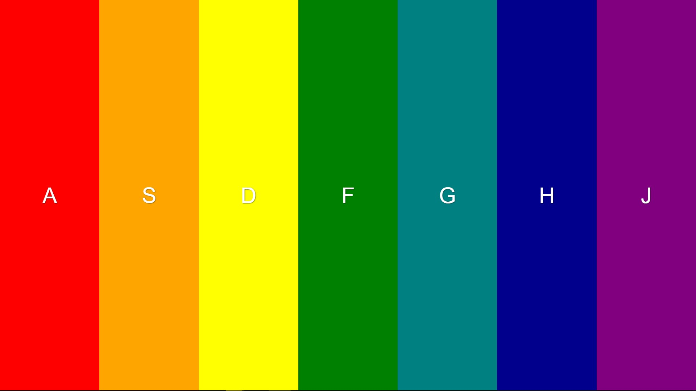

# Xylophone

> Xylophone web app built with vanilla javascript.

## YouTube

If you want to know how I created this, check out the youtube tutorial created by me [Xylophone](https://youtu.be/Phh8SBuwNIE)

## Screenshot

## License

This project is licensed under the MIT License

## Developed by Reagan Ekhameye (Tech Reagan)

Reach me on twitter [@techreagan](https://www.twitter.com/techreagan)
